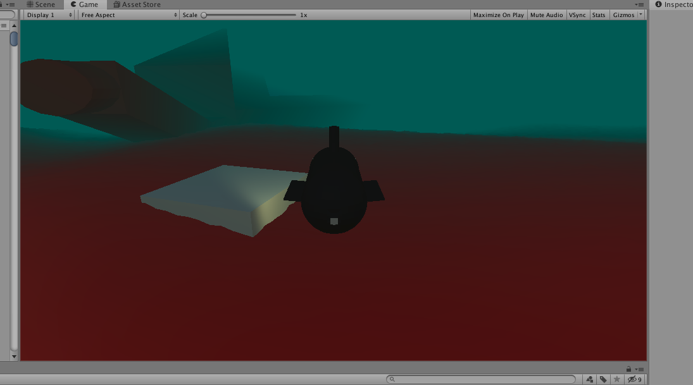

# SubExplorer
3D Submarine Exploration game written in Unity

## Copyright

Copyright (c) 2020 by Callum Wilson. All Rights Reserved.

## General Description
User navigates a procedurally generated underwater world. They need to find underwater stations
at which they can dock and explore to find upgrades and Story fragments.

The player is trying to fix up their submarine so they can explore the deeper waters?

## Current State
At the moment you can float around a little procedural map with a station in it.

## Game Mechanics
* Docking To stations
* First Person Exploration of stations
* Submarine Combat (Pirates? Secret Organisations?)
* Stealth: need to shut off engines to avoid detections
* Sonar: can use Sonar pings to reveal enemy positions (at a distance), however, if you do it enough
it also reveals your own position
